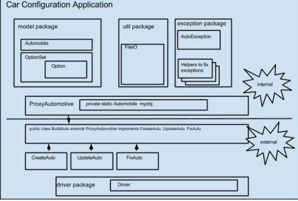

# Project Description

This is a Java prototype for a Kelly Blue Book like car configuration application, with an emphasis on Object Oriented Design.
The application is developed in six units.
1. Develop a reference based object model for automotive. The base object model is built from a text file and archived using Serialization.
2. Develop APIs for car configuration classes, using interfaces and abstract classes. Also add a custom exception handler to enhance the design.
3. Re-implement the previous two units with the same functionality, but better designed to handle multiple automotive models.
4. Add concurrency to the application. Setup a scalable struture for multiple users.
5. Build a client-server application from the previous units using java.net API.
6. Add web functionality to the application. Allow users to use web to configure a car and display the results and total price.

## Design Consideration and Lessons Learned

These are the OOP design considerations and lessons learned while developing this application.

### Unit 1

1. Object Containment:
Auto object contains OptionSet, and OptionSet object contains Option. Containment is a "permanent" relationship. It means OptionSet "lives" in Auto. It is "a part of" Auto, and "till death do us apart" (which means, OptionSet will die when Auto object dies). The same principle applies to OptionSet and Option.

2. Object Encapsulation:
This design has encapsulated the implementation details of OptionSet and Option. To access OptionSet and Option, one has to go through Auto. We encapsulate "components", not just variables and methods.

3. Object Association:
In FileIO class, writeObject methods uses Auto object. This relationship is called Association, such as writeAutoObject(Automobile a1, String fileName). But this relationship is temporary. Once it's gone out of the scope, the Auto object no longer exists.

4. To better analyze and design Objects, and make them extensible:
•	Look for nouns in the requirement. In this unit, we see the auto model FocusWagonZTW, and many properties of this particular car. So, we know we probably will create some objects from these "nouns".
•	Think about how these "nouns" related to each other? How do these properties related to FocusWagonZTW? Are they part of FocusWagonZTW? Of course! Thus, we have Auto contains Properties(OptionSet and Options)
•	Think about extensibility. Are we only going to create one type of car: FocusWagonZTW? No, we may have all sorts of cars. So, we create Auto class, not FocusWagonZTW class.
•	With Auto class, it is easily extensible. We can create "TransportationTool" as parent class, or create "ElectricCar" as a child class. The possibility is endless.
•	Think about how to separate the internal world with the external world, and encapsulate the internal implementations. Later on,  we could also create interfaces and abstract classes to further extend the application.
•	Think about how to create a common interface for the user to enhance the user experience.
For example, right now, we have FileIO class to read/write data. But what if we add database to read/write data? How about other mechanisms to read/write data in the future?
We can create one common interface for the user to read/write data, and encapsulate the internal implementation details. On our side, we can create many different classes to implement this common data interface, and to accommodate many different types of data source.

5. Avoid spaghetti code, and separate responsibilities when designing classes:
•	Create model package, and Auto, OptionSet and Option classes to handle the business logic.
•	Create util package and FileIO class to handle the FileIO responsibilities, instead of putting these methods in the Auto class.
•	If, we have a database, we could create a database package, and a DBHandler class, to handle the interaction with the database. Again, NOT to put these responsibilities in the Auto class.
•	This creates a clean separation of core business classes from the util/helper classes, and make it easier to read and maintain the code. Also make it easier to extend the application.

6. Use CRUD principle when creating methods for the core business objects:
For example, write CreateAuto, PrintAuto, UpdateAuto, and DeleteAuto methods as well as CRUD methods for OptionSet and Option.

7. To strike a balance between user friendly and engineer friendly when designing data file format:
We have a data file in this project. How are we going to approach it? We can choose XML, Json, Excel, or plain text file, or maybe some other format.
XML and Json are engineer friendly, however, it is difficult for a business user to learn how to create them.  So, we go with a plain text file.
However, to make the file comes with some kind of formality is also important. We can't just let the user freely "express" the data. So, we use comma separated file. It is commonly used in the business world,  and easily handled by the engineers.

8. Why use Serialization in this particular project:
Since we do not have a database to persist the object states, when we exit the application, all the objects stored in the memory will be gone. Serialization provides a way for us to save/write object state to disk and read them back when needed.

9. One issue I had when trying to serialize the Auto object, was the need to make inner class Option implement Serializable. Or it would cause exception. JVM is not flagged to create the category for inner classes, thus the exception.  (Option values would be null). So, to serialize an object, any class that is referenced by this object needs to implement Serializable.

10. To help developers debug, always include a print method for every class. This method will print out the state of the object. We can create a global flag, and use it to turn it on or off with the print method.

### Unit 2

1. Why create API?
•	Create a binding contract between the API and the classes that implement it. In this project, Creatable and Updatable and Fixable interfaces enforce the classes to implement the methods defined in the interfaces. It also restrict genericity. Because the methods only accept specific type of input as defined.
•	Enable classes from different families to share the same interfaces and the methods defined in the interfaces. We don't care what objects, we just care about "what they do".
•	For example, in this project, Creatable, Updatable and Fixable are implemented for Autos, but consider the need to expand our project to cover other objects beyond Autos, we could still use these interfaces.  Other objects could "Create", or "Update", etc.
•	Provide role-based access to functionalities. For example, an object implements only Creatable will not have access to functionalities defined in Updatable.

2. Another perfect example is Microsoft Word and Excel:
•	They are two different software, but they both have behaviors like "Copy", "Paste", "Cut", etc.  These method can all be defined in an interface, and make the software implement these methods. As users, we do not need to know the implementation details, but we have a similar user experience, as they all contain the similar methods.

3. All interface methods should be public and void. Why?
•	The need for polymorphism.  Different classes can implement these methods differently, process different types of data.

4. Abstract class, internal and external world,  and more on Encapsulation:
In this project, I create the ProxyAuto abstract class. The role of ProxyAuto class is:
•	Create another layer of encapsulation.  Users do not directly access methods in the Auto class, but through ProxyAuto.
•	Bridge the internal and external world of the software. It implements all the methods defined in the interfaces, which users see (external world).  However, these methods are mostly "wrapper" methods that use the internal components.
•   Add another layer of encapsulation by creating a concrete EMPTY class BuildAuto to extend ProxyAuto. Make BuildAuto implement all the interfaces. BuildAuto is an empty class that users can see. It now hides ProxyAuto from the external world. All the implementation details in the ProxyAuto can only be accessed via BuildAuto.

5. ProxyAuto defines "what", but not instantiatable as an abstract class:
•	It provides compile-time safety so that we can ensure that any classes that extend ProxyAuto provide the bare minimum functionality to work. And we don't need to worry about putting stub methods that inheritors somehow have to magically know that they have to override a method in order to make it work.
•	By adding BuildAuto class that extends ProxyAuto, we can now instantiate an BuildAuto object that implements certain type of interfaces.

6. Static Auto object in ProxyAuto class. Why?
This is called Singleton design pattern. With this design pattern, we can:
•	Ensure that only one instance of a class is created
•	Provide a global point of access to the object
•	Allow multiple instances in the future without affecting a singleton class's clients

In this project, if the Auto object in ProxyAuto is not static, then every time a BuildAuto object is created, there will be a new Auto object. So, the state of the Auto object will NOT be persisted while going through one BuildAuto instance to another.

7. Custom Exception Handling and Self Healing Software:
•	Write code defensively. Avoid common exceptions before they occur. For example, check for the file existence before processing it.  Much of this project deals with reading, processing, and writing files for auto. I believe it would be better if we could provide a web interface or other GUI interface and make users enter/select correct information before even saving to the file. Prevention beats fixing it afterwards.
•	Place try catch block close to where the exceptions may occur. For example, place it at where the input file is open for read. Do not put try-catch block around the entire main() method. That is a lazy way of handling it.
•	Carefully organize the exceptions to certain categories, and if necessary, create custom exception class.  For this project, I create AutoException class (custom exception class extends Exception ) to track the error number and error message.  This is also a perfect place to use enumeration.
•	Log the exceptions to files with the methods in the AutoException class with useful information to help with debugging.  Useful information includes timestamp, error number, error message, etc.
•	Also create Fixable interface to provide a common interface for fix methods accessible. ProxyAuto class makes the implementation details by wrapping around the AutoException and FixFileIO class methods, and BuildAuto provides access.
•	In FileIO class, I have a few parser methods to help parse the input file. These parser methods throw(throws) my AutoException. Then, in the FileIO class,  buildAuto method, I try and catch them, and fix them in the catch block. This is the concept of Self-Healing.
•	We can categorize exceptions to different levels. We must handle these mission critical, show stopper exceptions. On the other hand, create a graceful way to handle minor exceptions. In our project, one such "mission critical" exception would be "FileNotFound". With NO file, we cannot build the Auto object!
•	Complete Self-Healing is unrealistic in the real world. If we try to check and fix every possible exception, we will never be able to release the software.

8. Another important lesson learned regarding Exception Handling:
Test my code early and often. Do not wait until I finish writing all my code before I start testing. That can be overwhelming. Sometimes we want to rush things, so we take shortcuts. But in the end, it comes back and bite us.

### Unit 3

1. Decide which collection to use:
Size matters: How large is the data? Memory usage requirement?
Usage: CRUD (More create than read? Or more read than create? How often each of these operations performed?)

Use of ArrayList:
•	We replace all the arrays to ArrayList in the project. Array is fix sized, and we have need to build different cars with different OptionSets and Options, so we replace array with ArrayList. (ArrayList is like a variable sized array)
•	OptionSets and Options for each Auto are limited to a relative small number, so ArrayList is a good collection to use. We do not have a need for large chunk of sequential/contiguous memory for OptionSets and Options for each Auto.

Use of LinkedHashMap:
•	The LinkedHashMap implements a normal hashtable, but with the added benefit of the keys of the hashtable being stored as a doubly-linked list. LinkedHashMap maintains insertion order of keys, i.e the order in which keys are inserted into LinkedHashMap. At the same time, it also has the performance of HashMap.
•	HashMap is similar to Hashtable with two exceptions – HashMap methods are unsynchornized and it allows null key and null values unlike Hashtable. It is used for maintaining key and value mapping.
•	We choose to use LinkedHashMap for storing Autos because:

The number of Autos could be very big. By using LinkedHashMap, we do not need to allocate huge chunk of sequential/contiguous memory to store the data.

Create and Search can both be very fast because of the "HashMap".

2. We make this LinkedHashMap auto static, so the state will be maintained throughout the program.

3. Encapsulation on the collection:
Create a new Inventory/Fleet class in the model package to encapsulate the Auto for the collection. This new Inventory class contains the LinkedHashMap instance, and does the CRUD operations on the collection. Then, in ProxyAuto, create a static Inventory object.  Therefore, the CRUD operation on the LinkedHashMap is encapsulated.

4. Use of Choice variable:
Reflect the user choice on the Options.
Do not confuse Options with Choices. Options are part of Auto object. They come with each Auto object. Choices are only valid when user configures an Auto. Each user can have very different choices for the same Auto; but Options for each Auto objects are the same.
When user makes a choice, do it in OptionSet. In the Auto object constructor, we set the choice.

### Unit 4

1. Good design for API: Dual Mechanism (like Thread class and Runnable interface for threading):
The ability to extend the class, and the interface to implement.
In this project, we have BuildAuto class that can be extended, and many interfaces can be implemented.

2. In Java, when we start a thread, it will let the OS know, then OS will schedule its turn to run. (Unlike C++, when you create a thread, it will just run). In Java, we have to explicitly start a thread.
Also, unlike C++, we do not need to explicitly join, aka, destroy the threads. Threads are objects that will be automatically garbage collected.  We can just set the thread object to null and forget about it.

3. The need for multithreading in our project:
When more than one user tries to edit an Option for an Auto object at the same time, we do not want them to interfere with each other, and cause data corruption. So, we use threading to manage the editOption.

4. The order of the thread execution is underterministic:
When we have two editOption threads running, we programmers have no control over which thread runs when.  I changed the order of the code for which thread started first, which one started next, and the actual running orders/results were unpredictable.

5. . Where to synchronize:
On the object? or the operation on the object? Depends on which one takes less time.

In this project, we synchronize on the operations: editOption method.

Reasons to not synchronize on the Inventory class in model package:
•	Locking the list of autos does NOT lock each object inside it
•	No backwards compatibility. This multi thread operation is a new functionality, and should not break the existing functionalities.

Reasons not to lock the Inventory variable in ProxyAuto:
•	Could cause bad performance. Why would you want to lock the entire inventory list for all possible operations? Only synchronize operations where the race condition and data corruption may happen
as synchronization carries an overhead. We only lock this method for the short duration the editing needs to improve performance.

### Unit 5

1. Serialized objects need to be in sink between the Client and Server:
When I made some changes to OptionSet on the Client side, and didn't make the change to the Server side, it threw an exception.

2. Client-Server programming requires careful organization. The two sides need to have "hand-shake", and know exactly what to do at what order.
For example, if the client expects to read an ArrayList<String> of Auto names, and the Server sends something else, exception will be thrown.
So, I have to carefully think about the order of execution of the program on both sides, make sure one sends what the other wants, and one receives what expects.

3. The advantage of using object stream:
Any type of object can be serialized and send or received as an object stream. I can write one sendObject method and one readObject method to handle them all.

4. Create multithreaded Server:
ServerSocket accept() method returns a socket object, and passing it as parameter to a DefaultSocketClient constructor that creates a DefaultSocketClient instance. Then, start the DefaultSocketClient instance. And DefaultSocketClient class extends Thread. Therefore, server is now multithreaded.
Another way to make the Server multithreaded is to make ServerSocket class extends Thread.

5. Create an AutoServer interface for the Server:
With business methods that needed to process this client-server programming. And use ProxyAuto and BuildAuto to implement the methods and encapsulate the implementation details. The internal class used is BuildCarModelOptions.

6. Plug in architecture:
We want to add new client-server functionality. So,  we add new interface and business classes for it. But we can still use the existing ProxyAuto and BuildAuto without touching the existing functionality. This provides backwards compatibility and extensibility.

Say now if we want to add a database part. We can add classes to handle CRUD operations from the database. And we can still use the same interfaces, like Creatable, Updatable, Editable, AutoServer, to maintain a consistent experience for the external world.  And users wouldn't notice the difference.

So, be the data coming from a text file, or database, or anything else may be added in the future, the current  architecture can provide extensibility it needs.

### Unit 6

1. Separation of backend and frontend:
I use JSP to present the the HTML(the frontend), and Servlet to handle the retrieving Auto objects and processing Auto objects (the backend).
Writing lots of HTML in Servlet is painful. And let JSP handle that part is much easier. Servlets just need to figure out what data to send over to JSP.  The Servlet interacts with the client to retrieve the data.

One more thing I could have done, is to create another interface. This interface will handle the methods of interacting with the Client to get the data. Then write another class to implement these methods.
Then the Servlets will just call these methods in doGet() or doPost() to get the data, and passing it along to the JSP pages.

2. The web part of configuring a car is a BETTER way than letting users freely enter values in a console.
Because it would greatly reduce human errors when inputting values, and reduce the chance of bad data entered in. Select and Click is much less prone to mistakes than free entry.

### Future Improvement

Add mobile application with Android

## Acknowledgements

* https://sites.google.com/site/ecejavaandroid/home

